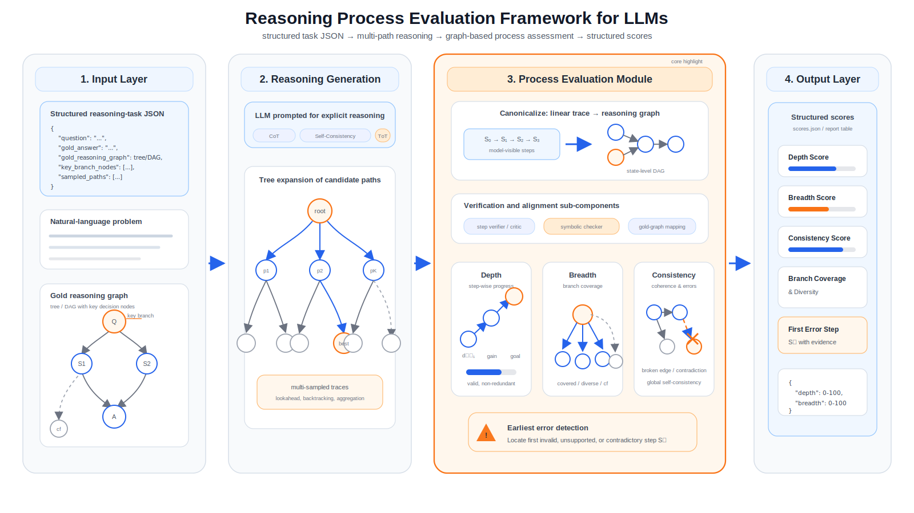

# 大模型逻辑推理广度与深度评估算法：调研与方案文档

> 文档版本：v0.1  


---

## 0. Abstract

本课题定义为：**把大模型的显式推理过程从“线性文本”抽象成“推理树/图”，分别衡量其每一步是否真的向目标推进（Depth），以及是否在关键决策点覆盖了足够多的有效候选分支（Beadth）**，并最终输出自动化、可复现、可扩展的过程评测框架。

<p align="center">
  
</p>

<p align="center"><b>Figure 1.</b> System overview of the proposed reasoning process evaluation framework. Structured task JSON and graph-based ground truth feed multi-strategy reasoning generation (CoT, Self-Consistency, ToT); model traces are canonicalized into reasoning graphs and assessed by verifier/critic, symbolic checker, and gold-graph alignment along Depth, Breadth, and Consistency, producing structured process-level metrics.</p>


---

## 1. 题目Brief：Input / Output / Boundary

### 1.1 Orientation

评估：

1. **局部逻辑有效性**：某一步 `S_t` 是否能够推出 `S_(t+1)`，是否缺少隐含前提；
2. **深度（Depth）**：每一步是否产生了非冗余的、朝目标前进的逻辑增益；
3. **广度（Breadth）**：模型在关键分叉点是否探索/覆盖了足够多的有效假设空间，而不是只走一条“贪心路径”；
4. **一致性（Consistency）**：全局推理链是否自洽、是否过早断裂、是否出现回路/矛盾。

区别于传统 GSM8K/MATH 的answer-oriented评测， 本项目更偏向 **process supervision / reasoning process assessment** 的方向。

### 1.2 Input定义

把单条样本定义为一个 JSON 对象：

```json
{
  "id": "sample_0001",
  "task_type": "math|fol|deduction|non_monotonic",
  "question": "...",
  "gold_answer": "...",
  "gold_reasoning_graph": {...},
  "key_branch_nodes": [...],
  "counterfactual_branches": [...],
  "model_prompt": "...",
  "model_response": "...",
  "sampled_paths": [...]
}
```

which：

- `gold_reasoning_graph`：Ground Truth 推理结构图；
- `sampled_paths`：模型一次或多次采样得到的显式推理路径；
- `key_branch_nodes`：用于测“Breadth”的关键决策节点；
- `counterfactual_branches`：用于测“有效分支覆盖率”的反事实分支。

### 1.3 Output定义

输出以下核心分数：

- `Score_Depth (0-100)`：推理深度；
- `Score_Breadth (0-100)`：推理广度；
- `Score_Consistency (0-100)`：推理一致性；
- `First_Error_Step`：最早错误步位置；
- `Missing_Premise_Flag`：是否存在隐含前提缺失；
- `Branch_Coverage`：关键节点有效分支覆盖率；
- `Branch_Diversity`：分支多样性；

### 1.4 Boundary

**Focus on 可验证推理任务**：

1. **数学推理**：可用答案检查器或符号系统验证；
2. **一阶逻辑/规则推理**：可用 FOL prover 验证；
3. **多步演绎/非单调推理**：可构造明确的推理图。

i.e.，**评估“模型可见的显式推理过程”**，而不是不可观察的内部状态。

### 1.5 Evaluation

#### Depth

令：

- `v_t`：第 `t` 步是否有效（由 verifier / critic / symbolic check 给出）；
- `d_t`：当前状态到目标状态的图距离或证明距离；
- `r_t`：该步是否冗余/重复；

则可定义：

`Depth = 100 * (Σ_t v_t * max(0, d_(t-1)-d_t) * (1-r_t)) / Z`

含义：只奖励**有效且真的缩短了目标距离**的步骤。

#### Breadth

对每个关键分叉节点 `j`：

- `cov_j`：有效分支覆盖率；
- `div_j`：分支多样性；
- `cf_j`：反事实分支覆盖率；

可定义：

`Breadth = 100 * Σ_j w_j * (α*cov_j + β*div_j + γ*cf_j)`

#### Consistency（建议）

综合以下因素：

- 最早错误步位置；
- 局部矛盾数；
- 全局自洽性；
- 多次采样的一致性。

---

## 2. Datasets

### 2.1 Strategy

**项目预计采用“开源 benchmark + 动态synthetic数据”**

调研表明，现有 benchmark 往往只覆盖其中部分维度：

- 仅最终答案（GSM8K、MATH）；
- 仅形式逻辑可验证（FOLIO、PrOntoQA、ProofWriter、ProverQA）；
- 仅多步深度与规则组合（Multi-LogiEval）；
- 仅过程错误定位（PRM800K、ProcessBench）。

这些对于“断裂检测 + 深度 + 广度 + 一致性”是不够的

### 2.2 Current Datasets

#### A. 数学推理种子集

1. **GSM8K**：包含 **8.5K** 高质量小学数学文字题，可作为“短链、可验证、强基线”的来源。
2. **MATH**：包含 **12,500** 道竞赛数学题，并提供逐步解答，适合作为长链深推理来源。

#### B. 形式逻辑/可证明推理种子集

3. **FOLIO**：**1,430** 个带 FOL 标注且可由 FOL inference engine 验证的自然语言逻辑样本。
4. **ProofWriter / RuleTaker 系列**：适合构造“自然语言理论 -> 蕴含/证明/缺失前提”的任务。 
5. **PrOntoQA**：专门用来分析 CoT 是否真的会“proof planning”；论文结论指出模型往往会做对局部 deduction，但不会系统探索多个证明选项。
6. **ProverQA / ProverGen 框架**：通过 **LLM + symbolic prover** 生成可扩展、高质量、带中间步骤的 FOL 推理数据，非常适合本项目的数据生成目标。

#### C. 多步深度/多规则组合集

7. **Multi-LogiEval**：覆盖命题逻辑、一阶逻辑、非单调逻辑，含 **30+ inference rules** 和 **60+ 规则组合**，并明确考察不同深度；其结果显示模型随深度增加显著退化（平均准确率约从 depth-1 的 68% 降到 depth-5 的 43%）。

#### D. 过程监督/错误定位集

8. **PRM800K**：OpenAI 发布的过程监督数据集，包含 **800,000** 条 step-level correctness labels，适合训练“步骤有效性判别器”。  
9. **ProcessBench**：包含 **3,400** 条带“最早错误步”标注的测试样本，适合用来校准/测试断裂检测器与 critic pipeline。

### 2.3 本项目数据构建方式

构建一个**2,000~5,000 题的benchmark**，来源是以上公开数据与合成框架。

#### 配比（后续可adjust/expand）

- 30% 数学短链：GSM8K 风格改写与扩展
- 25% 数学长链：MATH 风格长推理题
- 20% FOL/NL 演绎：FOLIO / ProverQA / ProofWriter 风格
- 15% proof planning / 多分支任务：PrOntoQA 风格
- 10% 非单调与反事实：Multi-LogiEval 风格

#### 每题的数据结构

1. 最终答案；
2. 推理图（树/DAG）；
3. 最短正确路径；
4. 若干有效替代路径；
5. 若干“看似连贯但实际上断裂”的负样本路径；
6. 关键分叉点标注；
7. 难度元信息（步数、规则数、分支度、是否需要回溯等）。

### 2.4 动态数据生成路线

借鉴 **ProverGen** 的方法：先用符号系统生成“可验证 latent proof space”，再由 LLM 自然语言化、再自动回验。

根据 **ProverGen** 提到，这样做的好处有：

- 可以得到真正可验证的 ground-truth 图；
- 可以控制深度、分支度、规则组合；
- 可以自动生成反事实分支和错误推理样本；
- 比纯人工标注更便宜、更可扩展。

---

## 3. Baseline

### 3.1 4-Layer baseline

#### Baseline-0：Answer-only

- 仅最终答案准确率；
- 作为weakest基线；
- 用来说明“只看答案”无法刻画Depth/Breadth

#### Baseline-1：CoT

- 使用 Chain-of-Thought prompting；  
- CoT 已被证明能显著提高复杂推理能力，是所有后续方法的基础基线。

#### Baseline-2：CoT + Self-Consistency

- 多次采样多条推理链，做一致性聚合；
- Self-Consistency 在 GSM8K 等推理基准上有显著提升，说明“多路径采样”本身就是广度的一个弱代理。

#### Baseline-3：ToT / Search-based

- Tree-of-Thoughts 允许模型探索多条中间 thought path，并在必要时 lookahead / backtracking；
- 最接近本项目“广度”定义的现成推理框架之一。

#### Baseline-4：Verifier / Critic

- 用 PRM、critic model 或 step-wise verifier 对每一步打分；
- “Let’s Verify Step by Step” 证明了 process supervision 对复杂推理训练比 outcome supervision 更有效；
- ProcessBench 进一步说明“最早错误步定位”是可独立评测的任务。

### 3.2 项目baseline组合

项目首轮跑以下 4 条 + baseline：

1. **Direct Answer**
2. **CoT**
3. **CoT + Self-Consistency**
4. **ToT + Critic/Verifier**

if资源允许，extra bonus：

5. **Least-to-Most + Critic**（适合把长推理拆成子问题）
6. **Symbolic-grounded Verifier**（基于 FOL / proof state 对齐）


## 4. Contributions

### 4.1 从“Answer Correctness”到“Process Evaluation”

传统 benchmark 主要输出 accuracy；本项目输出：

- Depth
- Breadth
- Consistency
- earliest error step
- branch coverage


### 4.2 从“线性链”到“树/图”

题图指出，要把 CoT 抽象成树结构。  
根据项目进展，我们或可能准备进一步从“树”扩展到“DAG”：

- 因为很多不同表述会回到同一中间证明状态；
- DAG 更适合做“去重”“冗余惩罚”“路径合并”。

### 4.3 从“token 数量”到“逻辑推进量”

题图强调：深度不是 token 数，不是repetitive。  
因此evaluation核心不要用长度，而要用：

- 目标距离缩短量；
- 规则应用有效性；
- 信息熵下降 / 不确定性减少；
- 对证据空间的约束收缩。

### 4.4 从“单次采样”到“多次采样 + 覆盖率”

只看单条推理路径，很难测广度。  
因此我们准备每题至少采样 `K=5~20` 条 reasoning path，用于：

- 统计有效分支数；
- 统计分支多样性；
- 统计是否覆盖关键竞争路径。

### 4.5 从“静态题库”到“动态生成 benchmark”

现有 benchmark 容易被模型记忆。  
借助 ProverGen 风格的 **symbolic latent space + LLM verbalization**，可按需生成新题、控制难度、避免过拟合


## 5. 算力资源、服务器资源与金额估算

> PS：以下**估算**。GPU 价格采用 Lambda 官方价格页；控制节点和块存储采用 AWS 官方页面；人民币按 2026-04-26 查询到的 `1 USD ≈ 6.832 CNY` 粗略换算。

### 5.1 三档资源方案

#### Plan A：MVP

适用目标：

- 2,000 题以内
- 只做小模型 verifier 或不训练 verifier
- 先完成 benchmark + 自动评分器原型

资源需求：

- GPU：`1 × A100 PCIe 40GB`，连续 7 天（168h）
- 控制节点：`1 × t3.large`
- 存储：`1 TB gp3`

费用估算：

- A100：`$1.99 / GPU / hr` × 168h = **$334.32**
- t3.large：`$0.0835 / hr` × 730h ≈ **$60.96 / 月**
- 1TB gp3：`$0.08 / GB-month` × 1000GB ≈ **$80 / 月**

合计约：

- **$475.27**
- 约 **¥3,247**

#### Plan B：标准研究方案

适用目标：

- 2,000~5,000 题
- 训练一个 7B/8B 级别 LoRA verifier / critic
- 4 条 baseline + ablation

资源：

- GPU：`2 × H100 PCIe 80GB`，各 14 天（336h）
- 控制节点：`1 × t3.xlarge`
- 存储：`2 TB gp3`

费用估算：

- H100：`$3.29 / GPU / hr` × 2 × 336h = **$2,210.88**
- t3.xlarge：`$0.1670 / hr` × 730h ≈ **$121.91 / 月**
- 2TB gp3：≈ **$160 / 月**

合计约：

- **$2,492.79**
- 约 **¥17,031**

建议再预留 15% 实验冗余：

- **$2,866.71**
- 约 **¥19,586**


### 5.3 服务器/软件栈

#### 训练/评测节点

- 2~4 台 GPU 节点
- Ubuntu / CUDA / PyTorch
- vLLM 或 TGI 作为推理服务

#### 控制节点

- 1 台 CPU 节点（任务调度、日志、结果聚合）
- 16GB RAM 即可，若并发大则 32GB

#### 存储

- Block storage：存 checkpoints / jsonl / logs
- 至少 1~2TB

#### 数据库/分析

- 初版可直接用 parquet + DuckDB
- 由于我们是4人协作和持续更新，加 PostgreSQL


## 6. 人员分工（4人，a/b/c/d）

### a：数据与 benchmark 负责人

职责：

- 整理 GSM8K / MATH / FOLIO / Multi-LogiEval / PrOntoQA / ProverQA 数据源；
- 设计统一 JSON schema；
- 负责动态数据生成脚本；
- 标注 key branch nodes 与 difficulty metadata。

交付：

- benchmark v1
- 数据清洗脚本
- 题目元信息统计

### b：评测算法与 verifier 负责人

职责：

- 设计 Depth / Breadth / Consistency 指标；
- 训练/微调 step verifier / critic；
- 实现 earliest-error detection；
- 完成核心评分引擎。

交付：

- scorer.py / evaluator.py
- verifier 训练配置
- 指标定义文档

### c：基础设施与实验平台负责人

职责：

- GPU 环境、推理服务、批量评测脚本；
- 多模型采样与日志回收；
- 结果看板、可视化、成本监控；
- 实验复现和版本管理。

交付：

- inference pipeline
- experiment runner
- 成本/吞吐统计表

### d：实验设计、分析与论文负责人

职责：

- baseline 选择与实验矩阵设计；
- 误差分析；
- 撰写技术白皮书/论文；
- 统筹时间线、组织周会、验收交付。

交付：

- 实验报告
- 对比图表
- 白皮书/论文初稿

### 协作建议

- a 与 b 每周对齐 schema 与标签定义；
- b 与 c 每周对齐模型接口与输出格式；
- d 负责把所有中间结果沉淀为表格/图；
- 每周至少一次 checkpoint review。

---

## 7. 现在可能存在的问题与预选解决方法

### 问题 1：显式 CoT 不一定忠实于真实求解过程

很多工作已指出，模型maybe“说得像在推理”，但中间步骤不一定真是决策依据。  
**Backup**：

1. 不把“自然语言prettiness”设置为高分依据；
2. 只奖励可映射到 proof state / graph state 的有效步骤；
3. 做 answer-only、CoT、ToT 三种输出对照；
4. 抽样人工核查“高分但答错”“低分但答对”的异常样本。

相关参考：CoT、PrOntoQA、ProcessBench。[R1][R4][R9]

### 问题 2：广度很难定义 ground truth

如果不知道“理论上有哪些有效分支”，就很难评估广度。  
**Backup**：

1. 优先使用可枚举 proof space 的任务；
2. 用 symbolic prover 列出关键节点的有效子分支；
3. 把广度限制为“关键节点上的有效覆盖率”，而不是无限开放空间。

相关参考：ToT、ProverGen、FOLIO、Multi-LogiEval。[R7][R10][R11][R13]

### 问题 3：深度容易退化为“更长更啰嗦”

**Backup**：

1. 明确加入 redundancy penalty；
2. 用图距离/证明距离代替 token 长度；
3. 对“重复改写同一步”的行为扣分。

相关参考：题图要求 + Multi-LogiEval 深度退化现象。[R11]

### 问题 4：过程监督数据迁移性不足

ProcessBench 指出，现有 PRM 对更难数学题泛化不稳定。  
**Backup**：

1. PRM800K 只作为 warm start；
2. 用本项目自建逻辑数据再做 domain adaptation；
3. PRM 与 critic 双轨制，不依赖单一 judge。

相关参考：Let’s Verify、PRM800K、ProcessBench。[R3][R4][R12]

### 问题 5：Automated Evaluation System本身会带bias

**Backup**：

1. 每轮实验抽样 5%~10% 人工复审；
2. 引入双评分器（critic + symbolic check）；
3. 记录 evaluator disagreement 作为不确定性指标。

---

## 8. Workflow pipeline

## Pipeline A：动态 benchmark 构建流水线

**目标**：生成题图要求的“2000+题 + reasoning graph ground truth”。

### 步骤

1. 从 GSM8K / MATH / FOLIO / PrOntoQA / Multi-LogiEval / ProverQA 取种子问题；  
2. 把题目转成 latent reasoning state（方程状态 / FOL state / rule state）；  
3. 用 symbolic prover / rule engine 枚举：
   - 最短正确路径
   - 若干替代正确路径
   - 若干错误分支/缺失前提分支
4. 用 LLM 将结构化 proof verbalize 成自然语言；
5. 回写为统一 JSON，并自动验证；
6. 人工抽检少量样本。

### 适用问题

- 数据稀缺
- Ground truth 分支空间不明确
- 难度不可控

### 参考

- FOLIO [R7]
- ProofWriter [R8]
- PrOntoQA [R9]
- ProverGen / ProverQA [R10]
- Multi-LogiEval [R11]

---

## Pipeline B：深度评分与断裂检测流水线

**目标**：定位 earliest error，并输出 Score_Depth / Score_Consistency。

### 步骤

1. 用 CoT 或 Least-to-Most 生成显式步骤；  
2. 对步骤做切分与 canonicalization；  
3. 用 PRM / critic / symbolic checker 对每一步判别：
   - 是否有效
   - 是否缺失前提
   - 是否只是重复表述
4. 将步骤映射到 gold reasoning graph；
5. 计算每一步的 progress gain；
6. 汇总为 Depth / Consistency / earliest-error-step。

### 适用问题

- “看上去通顺、实际上断裂”的步骤很多
- 需要自动定位错误最早发生位置
- 需要区分“长但无进展”和“短但高推进”

### 参考

- CoT [R1]
- Least-to-Most [R14]
- Let’s Verify Step by Step [R3]
- PRM800K [R12]
- ProcessBench [R4]

---

## Pipeline C：广度评分与关键分叉覆盖流水线

**目标**：输出 Score_Breadth，衡量模型是否覆盖关键有效候选分支。

### 步骤

1. 用 Self-Consistency 或 ToT 采样 `K` 条推理路径；  
2. 将不同路径映射为分支节点序列；  
3. 在关键节点上统计：
   - 有效分支覆盖率
   - 分支多样性
   - 反事实/竞争分支覆盖率
4. 对重复、同义改写、无效分支降权；
5. 聚合为 Breadth 分数。

### 适用问题

- 模型“只会贪心一路走到底”
- 同一答案能否通过多条合理路径到达
- 是否会主动探索竞争假设

### 参考

- Self-Consistency [R2]
- Tree of Thoughts [R13]
- PrOntoQA（proof planning 问题）[R9]
- Multi-LogiEval（深度和规则组合）[R11]

---

## Pipeline D：混合 evaluator 训练流水线

**目标**：训练更鲁棒的自动评分器。

### 步骤

1. 用 PRM800K 预热 step verifier；  
2. 用 ProcessBench 校准 earliest-error 定位；  
3. 用本项目自建的 FOL / graph 数据做 domain adaptation；  
4. 与 symbolic consistency check 做集成；  
5. 输出 evaluator uncertainty。

### 参考

- Let’s Verify Step by Step [R3]
- PRM800K [R12]
- ProcessBench [R4]
- ProverGen [R10]

---

## 9. Roadmap

### 第 1-2 周

- 完成 schema
- 跑通 3 个公开数据源
- 确定 baseline 列表

### 第 3-4 周

- 生成 benchmark v1（500~1000 题）
- 实现 earliest-error detector
- 实现初版 Depth scorer

### 第 5-6 周

- 实现 Breadth scorer
- 跑通 CoT / SC / ToT / verifier baseline
- 做第一轮误差分析

### 第 7-8 周

- 扩展到 2000+ 题
- 做消融实验
- 产出白皮书与答辩材料


---

## 参考资料

- [R1] Chain-of-Thought Prompting Elicits Reasoning in Large Language Models — https://arxiv.org/abs/2201.11903
- [R2] Self-Consistency Improves Chain of Thought Reasoning in Language Models — https://arxiv.org/abs/2203.11171
- [R3] Let’s Verify Step by Step — https://arxiv.org/abs/2305.20050
- [R4] ProcessBench: Identifying Process Errors in Mathematical Reasoning — https://arxiv.org/abs/2412.06559
- [R5] Training Verifiers to Solve Math Word Problems (GSM8K) — https://arxiv.org/abs/2110.14168
- [R6] Measuring Mathematical Problem Solving With the MATH Dataset — https://openreview.net/forum?id=7Bywt2mQsCe
- [R7] FOLIO: Natural Language Reasoning with First-Order Logic — https://arxiv.org/abs/2209.00840
- [R8] ProofWriter: Generating Implications, Proofs, and Abductive Statements over Natural Language — https://arxiv.org/abs/2012.13048
- [R9] Language Models Are Greedy Reasoners: A Systematic Formal Analysis of Chain-of-Thought (PrOntoQA) — https://openreview.net/forum?id=qFVVBzXxR2V
- [R10] Large Language Models Meet Symbolic Provers for Logical Reasoning Evaluation (ProverGen / ProverQA) — https://openreview.net/forum?id=C25SgeXWjE
- [R11] Multi-LogiEval: Towards Evaluating Multi-Step Logical Reasoning Ability of Large Language Models — https://arxiv.org/abs/2406.17169
- [R12] PRM800K GitHub — https://github.com/openai/prm800k
- [R13] Tree of Thoughts: Deliberate Problem Solving with Large Language Models — https://arxiv.org/abs/2305.10601
- [R14] Least-to-Most Prompting Enables Complex Reasoning in Large Language Models — https://arxiv.org/abs/2205.10625
- [R15] Lambda AI Cloud Pricing — https://lambda.ai/pricing
- [R16] Amazon EBS Pricing — https://aws.amazon.com/ebs/pricing/
- [R17] Amazon EC2 T3 Pricing — https://aws.amazon.com/ec2/instance-types/t3/
- [R18] Wise USD/CNY mid-market exchange rate — https://wise.com/us/currency-converter/usd-to-cny-rate

